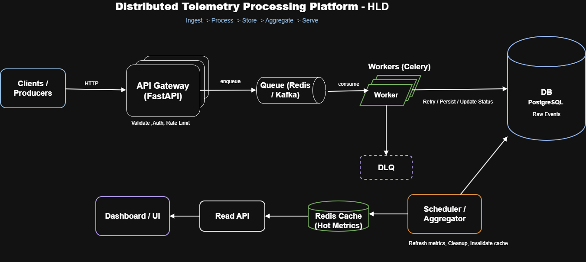
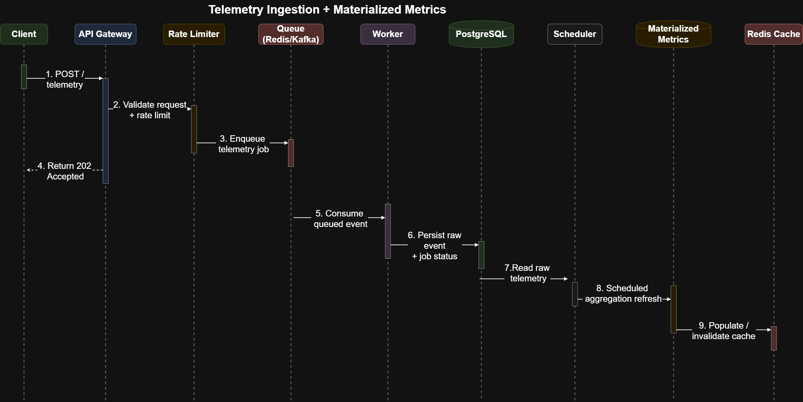
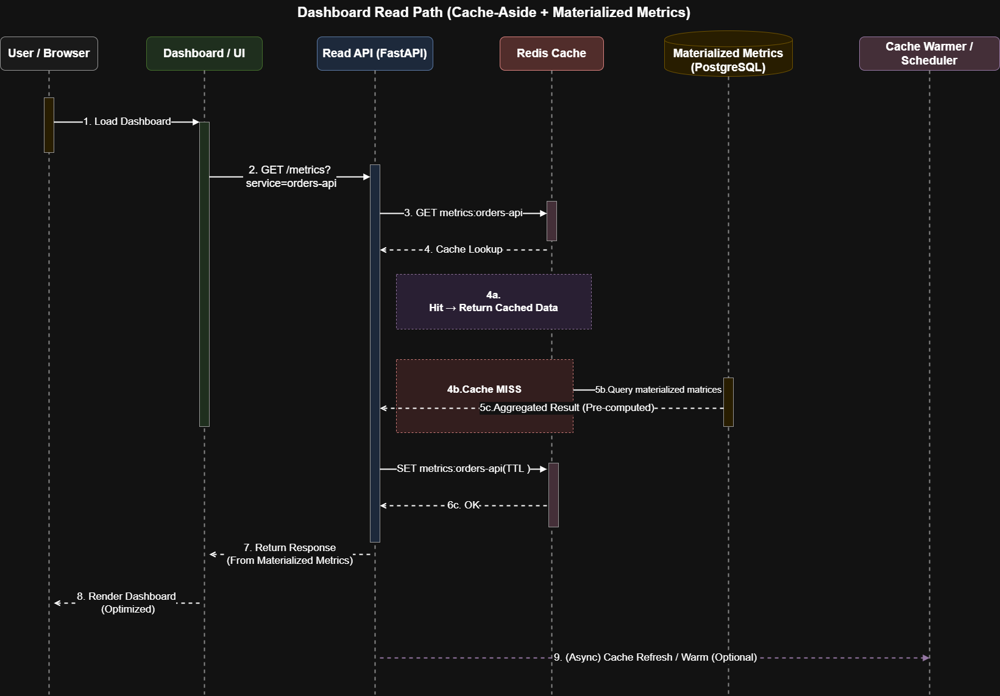

<h1 align="center">Telemetry Processing Platform</h1>
<p align="center"><i>Distributed Telemetry Ingestion and Materialized Analytics Platform</i></p>

## Project Summary

This is a telemetry platform built with a C++ backend and a React frontend. It demonstrates how telemetry events can be ingested asynchronously, persisted reliably, aggregated into materialized metrics, and served efficiently to dashboards through a cache-backed API.

The design intentionally separates the write path from the read path. This keeps ingestion fast under burst traffic while also keeping dashboard queries low-latency and predictable.

- Fast write path through asynchronous job submission and worker processing.
- Fast read path through materialized metrics and cache-aside reads.
- Clear modular backend layout for API, core, models, schemas, services, and worker runtime.
- Implements an end-to-end observability-style pipeline for telemetry ingestion, processing, and analytics.

## 1. High-Level Architecture

<p align="center">
  
</p>
<p align="center"><i>Figure 1. End-to-end architecture showing ingestion, processing, storage, caching, and dashboard serving.</i></p>

[Open draw.io source](docs/design/TelemetryAnalyzer_HLD.drawio)

At a high level, FabricPulse is organized into five major layers: client ingestion, API and validation, background processing, durable storage and aggregation, and dashboard serving. This separation makes the system easier to understand and scale.

- Clients submit telemetry through the API.
- The API validates requests, applies rate limiting, and acknowledges accepted work quickly.
- Queued work is processed by background workers rather than on the request thread.
- PostgreSQL stores raw telemetry, asynchronous job status, and aggregated metrics.
- Dashboard APIs serve cached or materialized metrics to reduce repeated expensive queries.

## 2. Telemetry Ingestion and Processing Flow

<p align="center">
  
</p>
<p align="center"><i>Figure 2. Async write path from telemetry submission to persistence and aggregate refresh.</i></p>

[Open draw.io source](docs/design/telemetryIngestion_MaterializedMatrics.drawio)

This flow focuses on the write path. A client submits telemetry to the backend, the request is validated, rate-limited, and turned into an asynchronous job. A worker later persists the raw event and updates job state. A scheduled aggregation step then computes summary metrics for dashboard queries.

- API returns quickly instead of doing heavy persistence work synchronously.
- Queue-style buffering helps absorb variable traffic and protects downstream components.
- Worker processing supports retry and status tracking for operational visibility.
- Periodic aggregation converts raw telemetry into cheaper query-ready summary data.

## 3. Dashboard Read Path

<p align="center">
  
</p>
<p align="center"><i>Figure 3. Cache-aside read flow using Redis or in-memory cache and materialized metrics.</i></p>

[Open draw.io source](docs/design/dashboard_read_path.drawio)

This flow focuses on the read path. Dashboard requests first check the cache. On a cache hit, results return immediately. On a cache miss, the backend reads from the materialized metrics table, stores the result in cache with a TTL, and returns the response.

- Cache hits provide lowest latency for repeated dashboard queries.
- Cache misses still avoid expensive raw-table scans by using precomputed summary metrics.
- This design lowers database pressure and improves p95 response time for common metric queries.

## Key Backend Components

- `app/main.cpp`: entry point that loads configuration, initializes schema, registers routes, and starts the server.
- `app/api/`: health, telemetry, and metrics endpoints plus shared HTTP response utilities.
- `app/core/`: runtime config, DB access, and in-memory sliding-window rate limiting.
- `app/models/`: telemetry event, job status, and metric model definitions with JSON helpers.
- `app/schemas/`: request parsing and telemetry payload validation.
- `app/services/`: aggregation logic and TTL-based cache implementation.
- `worker/`: background runtime and tasks for telemetry processing and metrics refresh.
- `scripts/`: sample event generation for local end-to-end testing.

## Data Stored by the System

- Raw telemetry events for full-fidelity history and troubleshooting.
- Job status records for queued, running, completed, or failed telemetry jobs.
- Materialized summary metrics for dashboard-facing analytics such as request count, latency, and error rate.

## API and Local Setup

- `GET /api/v1/health`: service liveness and readiness.
- `POST /api/v1/telemetry`: submit telemetry and receive a `job_id`.
- `GET /api/v1/telemetry/jobs/{job_id}`: inspect asynchronous job status.
- `GET /api/v1/metrics/summary`: read aggregated metrics through the optimized read path.

```bash
curl -X POST http://localhost:8000/api/v1/telemetry \
  -H "Content-Type: application/json" \
  -d '{
    "service_name": "orders-api",
    "event_type": "request_complete",
    "latency_ms": 120,
    "status_code": 200,
    "payload": {"region": "eastus"}
  }'